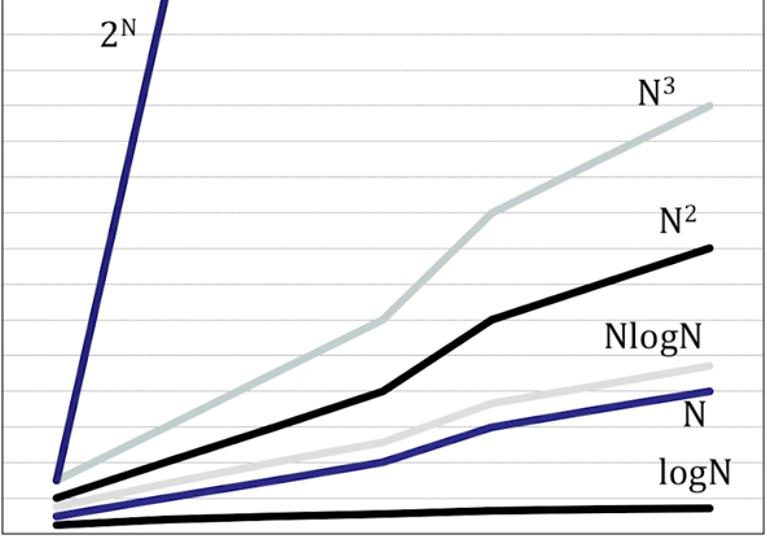
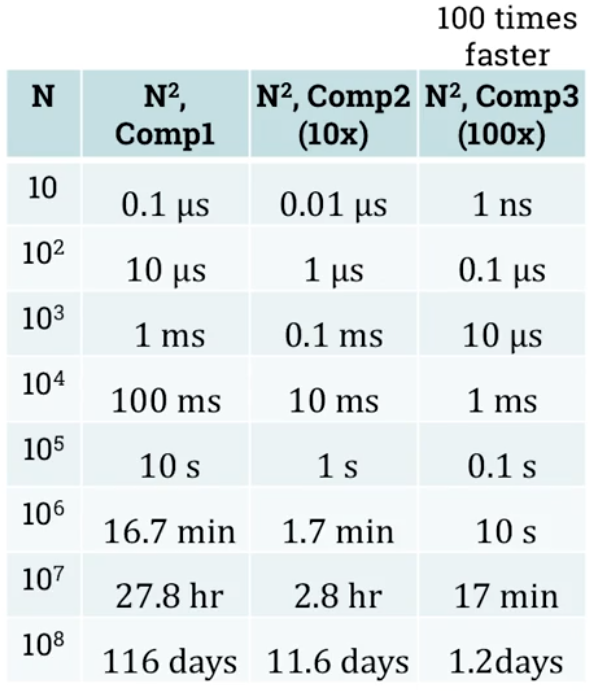
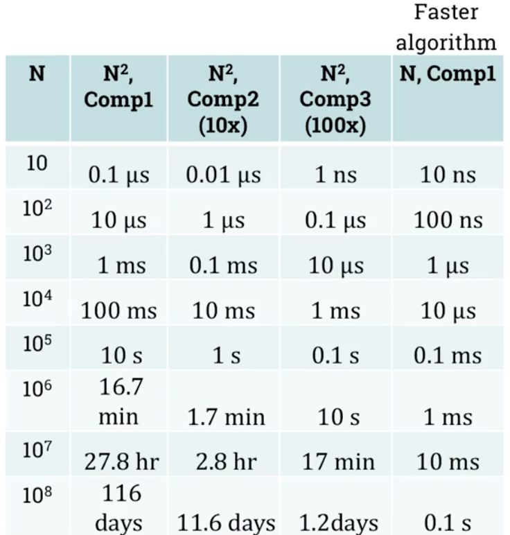

# Analysis of algorithms, part 1
## What is analysis of algorithms
- Possible aspects to analyze:
    - Correctness
    - Ease of understanding
    - Resource consumption

## How to measure/estimate time and space requirements
- Given the following pseudocode of an algorithm:
```
function F(array s)
    for 1 <= j < length(s) do
        key <-- s[j]
        i <-- j-1
        while i >= 0 AND s[i] > key do
            s[i+1] <-- s[i]
            i <-- i-1
        end while
        s[i+1] <-- key
    end for
end function
```
- **How much space and time would it need to be executed?**
- Empirical (measurement) approach:
    - Advantages:
        - Real/exact result on particular machine
        - No need for calculations
    - Drawbacks:
        - Machine dependant results
        - Implementation efforts, especially for complex algorithms
    - Use cases when it is the best choice:
        - Running algorithm on a specific machine for a time critical task
- Theoretical approach:
    - First have do decide on a particular machine/model/architecture we will be basing the calculations on
    - Advantages:
        - Universal results (for all machines that are the same as the one calculated for)
        - Not necessary to spend time implementing algorithm to analyze it
    - Drawbacks:
        - Only approximate results, not exact. So not good enough for time critical systems
        - Calculation effort (both in the matter of time spent, and accuracy)
    
### Theoretical approach
- In this module we will be focusing on theoretical approach, therefore we need to focus on three aspects:
    - Learning about machine model, characteristics of the machine we will base our calculations on.
    - Awarness of assumptions and simplifications of the chosen machine model to base our calculations on.
    - Be prepared to carry out all the necessary calculations

## The Random Access Machine (RAM) model
- Simplified representation of reality (computer).
    - 

### Four assumptions of running time
1. We have a machine with a single CPU, therefore instructions are executed sequentally
2. Each simple operation takes 1 time unit. Examples of simple operations:
    - Numerical: +,-,*,/,<,>,==, and, or, !
    - Control: if()..else, return, calling a function, 
    - Data movement: =
3. Loops and functions are NOT simple operations
4. Memory is unlimited, and there is no memory hierarchy and any memory access = 1 time unit.

### One assumption about memory
1. A simple variable uses 1 memory position, and array of N elements uses N positions

## Counting up time and space units. 
### Simple operations:
- Example simple function pseudocode:
    - Time Units:
        -   ```
            function F1(a,b,c)
                max = a         --> Total 2 time units. 1 memory read(a) = 1 time unit + 1 memory write(max) = 1 time unit. 
                if(b>max)       --> Total 4 time units. 2 memory reads(b, max) = 2 time units + 1 comparison(>) = 1 time unit + if instruction = 1 time unit. 
                    max = b     --> Total 2 time units. 1 memory read(b) = 1 time unit + 1 memory write(max) = 1 time unit. 
                if(c>max)       --> Total 4 time units. 2 memory reads(c, max) = 2 time units + 1 comparison(>) = 1 time unit + if instruction = 1 time unit. 
                    max = c     --> Total 2 time units. 1 memory read(b) = 1 time unit + 1 memory write(max) = 1 time unit. 
                return max      --> Total 2 time units. 1 return statement + 1 memory read (max)
                                ==> Total of 16 time units
            ```
    - Space Units:
        - ```
            function F1(a,b,c)
                    max = a         --> 1 new simple variable(max) = 1 space unit
                    if(b>max)       
                        max = b     
                    if(c>max)       
                        max = c     
                    return max      
                                    ==> Total 1 of space unit.
          ```

### More complex operations:
- Example of more complex function pseudocode
    - Time Units:
    - ```
      A: One dimensional array of integers
      N: Number of elements of A
      x: integer number

      function F2(A,N,x)
        for 0 <= i < N      --> 7N +5 Time units (1 initialising i to 0 + 4*(N+1) if(i<N) + 3N (i = i +1))
            if(A[i]==x)     --> 5N Time units (1 if + 1 == + 3 memory reads (x,i,A[i]))
                return i
        return -1           --> 1 Time unit
                            ==> Total 12N + 6 Time Units
      ```
    - Space Units:
    - ```
      function F2(A,N,x)
        for 0 <= i < N      --> 1 Space unit. New variable i
            if(A[i]==x) 
                return i
        return -1 
                            ==> Total of 1 space unit.
      ```
### Practice asignment: Counting time and space units
1. 
```
x = 2       --> 1 write. 1 Space
y = x + 1   --> 1 read,1 sum, 1 write. 1 Space
z = x*y     --> 2 read,1 multiply,  1 write. 1 Space
            ==> Total:  8 time, 3 space

```

2. 
```
y = 1               --> 1 time, 1 space
for 0 <= i <=N      --> 7N + 12 time, 1 space for i
    y = y * i       --> 4(N+1) (2 read x&y, 1 multiply, 1 write y)
                    ==> Total time (11N+7) Total Space 2 
```

4. 
```
i = 0         --> 1 write
while(i<2)    --> 9=3*3 (1 with i=0, 1 with i=1, 1 with i=2(1 while, 1 read i, 1 comparison))
    i = i + 1 --> Total 6=2*3 (1 read i, 1 sum, 1 write i)
              ==> Total 16 time, 2 memory
```

## Growth of functions
- Typical growth functions
    - 

### A: Square matrix (2D array) with N rows and N columns
- Check wheter each instruction takes constant time or not
```
function SumDiag(A)
    sum = 0                 --> Constant, C0
    N = length(A[0])        --> N (C1 * N + C2) see length function below
    for 0 <= i < N          --> N (C3*N+C4) |i = 0, constant, C3|(i<N), (N+1) times|i=i+1, N times
        sum = sum + A[i,i]  --> C5 * N
    return sum              --> C6
                            ==>T(N)=(C1+C3+C5)*N+(C0+C2+C4+C6)=N
                            This is Linear function, with T(N)

function length(A)
    l = 0                   --> Constant C1
    while(A[l]!=NULL)       --> N+1
        l = l + 1           --> N
    return l                --> Constant C2
                            ==> T(N)= C1 * N + C2 = N
```

## Faster computer vs Faster Algorithm
- Example with 10x and 100X faster computer and same algorithm
    - 
- Example with same computer but Linear instead of quadratic algorithm
    - 
- Good algorithm always pays off