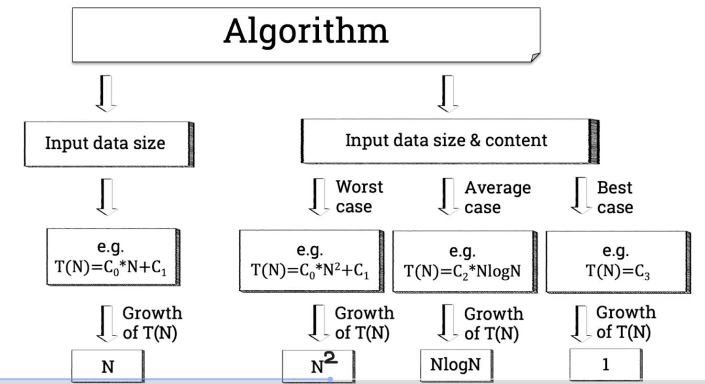
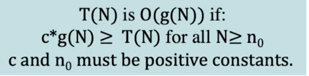

# Analyisis of algorithms, part 2.
## Worst and best cases
- 
- Find maximum algorithm
    
    ```
    # Finds largest element in array A

    function max(A)
        max = 0                 --> C0
        for 1 <= i < N          --> C1*N + C2
            if (A[i]>A[max])    --> C3*N + C4
                max = i         --> C5
        return max              --> C6
                                ==> T(N)= C7*N+C8 = N
    ```

- Linear search algorithm

    ```
    # Searches for element x in array A, when element not in array

    function linear_search(A,x) -->(A,7)
        for 0 <= i < N          -->C1*N+C2
            if(A[i]==x)         -->C3*N
                return i        
        return -1               -->C4
                                -->T(N)=N(worst case)
    # If element we were looking for was first one in the array, running time would be T(N)=1e(best casw)
    ```
## Introduction to Asymptotic Analysis
- Alternative way of describing time or memory requirements for algorithm
- Big-O notation was introduced by Paul Bachmann in his book 'Analytic Number Theory' in 1894.
- Big-O was created as a mathematical notation to describe the behaviour of a function when the argument tends to infinity
- Omega notation was introduced by Hardy and Littlewood in 1914
- In 1970 Donald Knuth introduced the Big-O and Omega into Computer science, and creates the Theta notation
- 

## Big-O notation

## Omega notation
- Omega acts as a lower bound