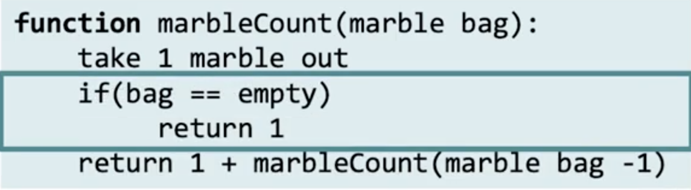
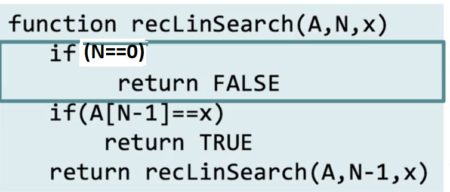

# Recursive algorithms, part 1
## Structure of recursive algorithms
- Recursive algorithm must have atleast one base case
- Recursive call should take us closer to the base case
- 

## Tracing recursive algorithm
- Summing two values recursively
- 

## From iteration to recursion
- 

## Writing a recirsive algorithm
- 
- 
### Recursive Linear Search algorithm 
1. First we check if array isnt empty. 
2. If not, we check if last element is the one we're after. 
3. If not, we pass it on as recursive case with N-1
- 