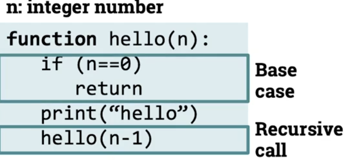
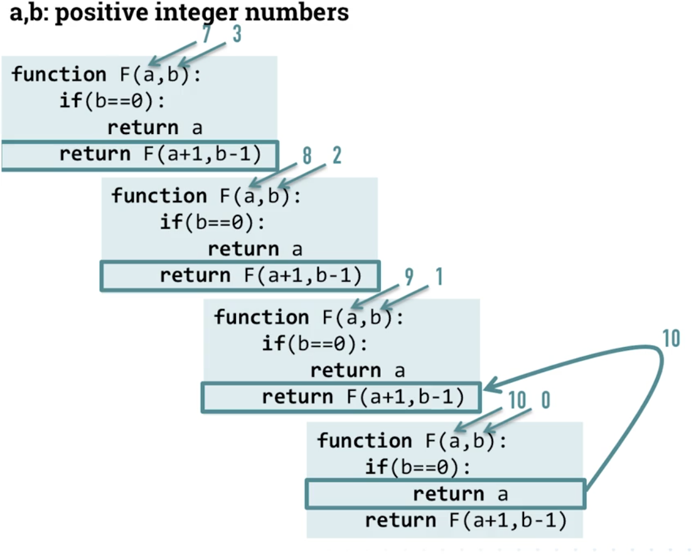
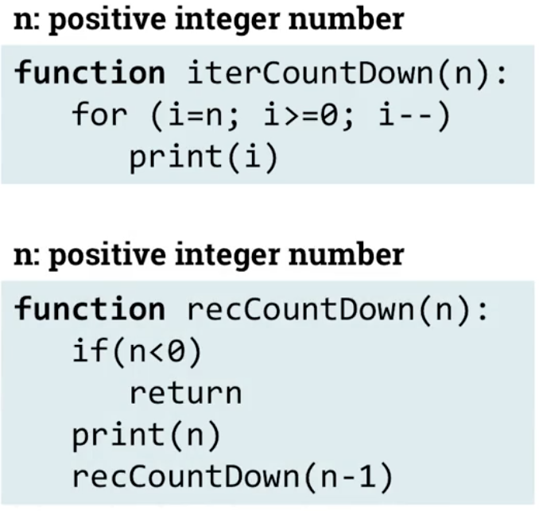

# Recursive algorithms, part 1
## Structure of recursive algorithms
- Recursive algorithm must have atleast one base case
- Recursive call should take us closer to the base case
- 

## Tracing recursive algorithm
- Summing two values recursively
- 

## From iteration to recursion
- 