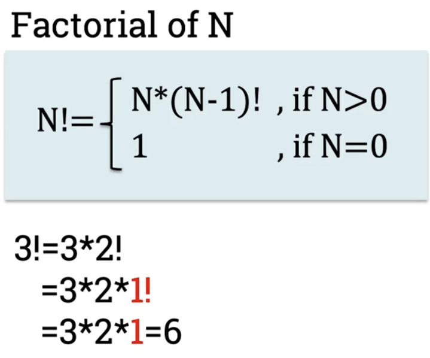
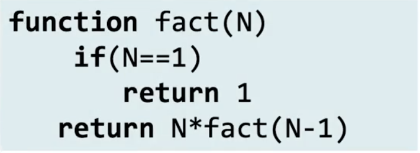
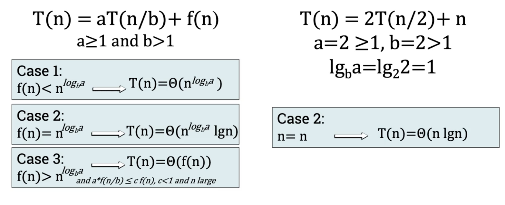

# Recursive algorithms, part 2
## Time complexity of recursive algorithms
- Time complexity is the asymptotic number of simple operations executed by an algorithm
### Recursive Factorial function
- 
- 
- 
```
function fact(N)
    if (N==1)               --> C0
        return 1
    return N*(fact(N-1))    -->C4+T(N-1) (C4=C1(return) + C2(N) + C3(*), T(N-1)=(fact(N-1)))
                            ==> T(N)=C5+T(N-1) (C5=C0+C4)
```

## Solving recurrence algorithms
- 
```
function fact(N)
    if(N==1)            -->C0
        return 1        -->C1
    return N*(fact(N-1))
                            ==>T(N)=C5+T(N-1)
```
1. Find a value of N for which T(N) is known
    - Usually easy to do with running time of the best case
    - In the best case for this algorithm, it evaluates the if statement, so N==1, and we execute C0 and C1.
    - Therefore we can say that 
        - **T(1)=C**
2. Expand right side of the equation until you can replace known value of T(N) in it
    - T(N)=C5+T(N-1) --> T(N)=C5+(C5+T(N-2)) -->T(N)=C5 + (C5+(C5+T(N-2))) --> and so on....
    - Therefore:
        - T(N) = k*C5+T(N-k) --> T(N) = (N-1)*C5+T(N-(N-1)) -->T(N)=(N-1)*C5+C -->T(N)=C5N+C6
        - Thus:
            - T(N) is O(N), O(N^2),O(N^3)...
            - T(N) is Omega(N), Omega(logn), Omega(1)...
            - T(N) is Theta(N)

## The master theorem
- Can only be applied if recurrence equation matches this pattern:
    - **T(n)=aT(n/b)+f(n) where a>=1 and b>1**
    - For example:
        - T(n)=T(n/2)+n
- Master theorem classifies equations into three cases
1. Case 1:
    - IF f(n) < n^logba:
        - T(n)=Theta(n^logba)
2. Case 2:
    - IF f(n)=n^logba:
        - T(n)=Theta(n^logba * lgn)
3. Case 3:
    - IF f(n)>n^logba:
        - Theta(f(n))
- Example:
    - 