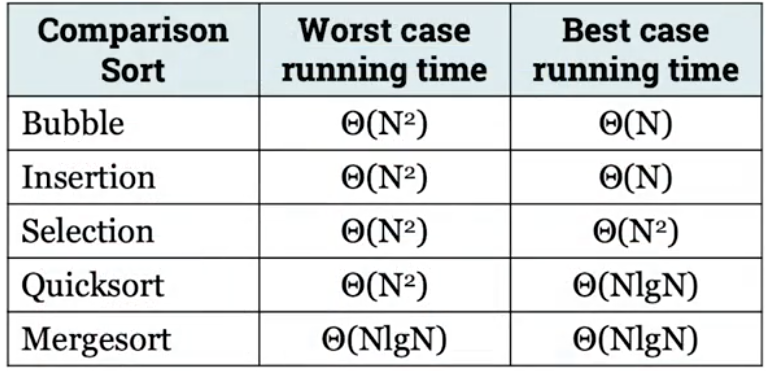
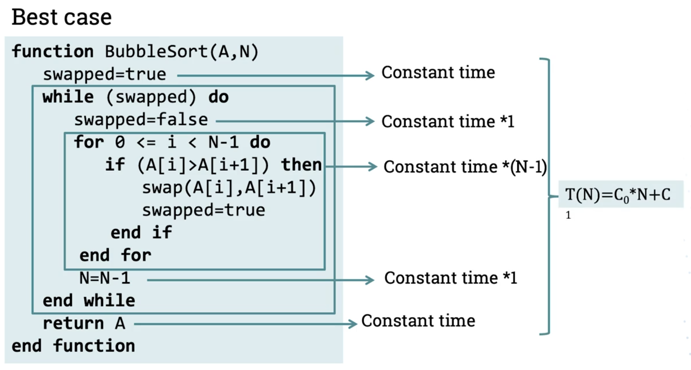
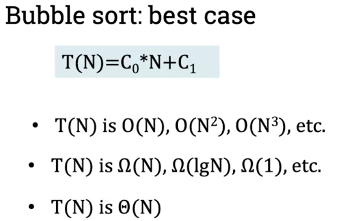
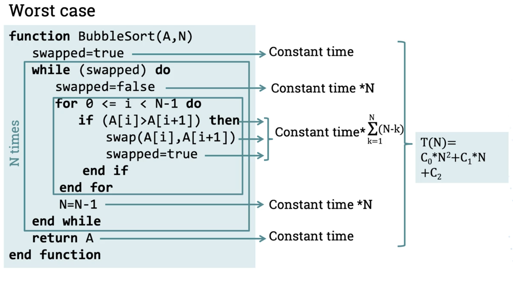
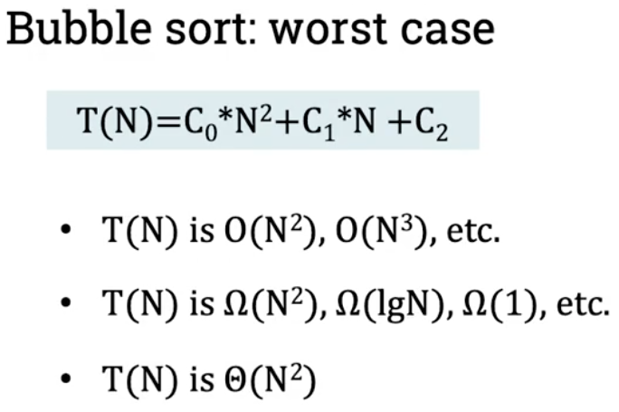
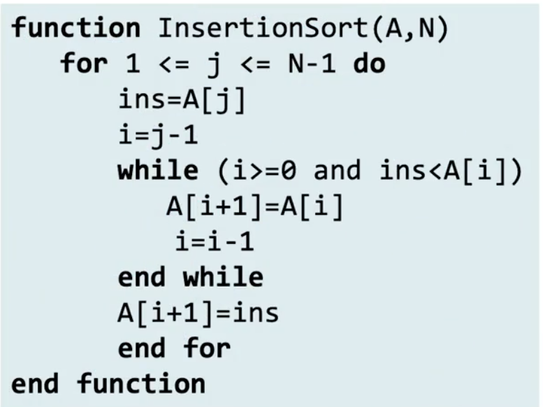

# Comparison sorting algorithms
- Comparison sorting algorithms:
    - Bubble Sort
    - Insertion Sort
    - Selection Sort
    - Quicksort
    - Merge Sort
    - 
- Non-Comparison sorting algorithms
    - Counting sort
    - Radix sort
    - Bucket sort

## Bubble sort
- Pseudocode:
    -
    ```
    function BubbleSort(A,N)
        swapped=true

        # Checks whether any swap was made during the last pass through array, if no pass was made, array must already be sorted, and algorithm finishes. If atleast one swap was made, will do another pass 
        xc
        while(swapped) do
            swapped=false
            # Passes through array and makes any necessary swaps. Each swap goes full pass through, so largest element will end up at the end
            for 0 <= i < N-1 do
                if (A[i]>A[i+1]) then
                    swap(A[i], A[i+1])
                    # If atleast one swap was made, set 'swapped' back to true
                    swapped=true
                end if
            end for
            N=N-1
        end while
        return A
    end function
    ```

### Bubble sort time complexity
- Best case:
    - 
    - 
- Worst case:
    - 
    - 

## Insertion sort
- Pseudocode:
    - 
    ```
    function InsertionSort(A,N)
        # FOR loop selects the next element to be inserted in the sorted part of the array(starts with second element, yes)
        for 1<=j<=N-1 dp
            # making copy of the number we are inserting as it may get lost
            ins=A[j]
            # i is used to visit the sorted part of the array (r to l)
            i=j-1
            # core of algorithm.
            while (i>=0 and ins<A[i])
                A[i+1]=A[i]
                i=i-1
            end while
            # number inserted in the correct position
            A[i+1]=ins
            end for
    end function
    ```
    - 

## Selection sort
- Pseudocode:
    - 
    ```
    function SelectionSort(A,N)
        # for loop is in charge of determining where next minimum number is stored
        for 0<=i<=N-1 do
            # pos_min returns position of the minimum value between positions a and b (both inclusive) in array A
            min=pos_min(A,i,N-1)
            swap(A[i],A[min])
        end for
    end function
    ```