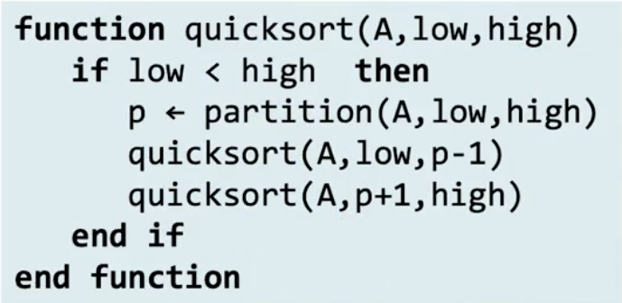
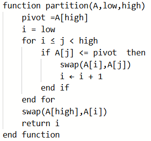
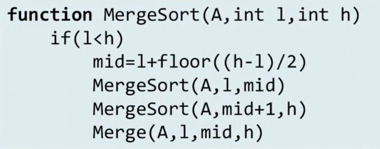

# Comparison sorting algorithms part 2
## Quicksort
- Chooses pivot, and then:
    - Store all numbers smaller than the pivot to its left
    - Store all numbers larger than the pivot to its right
    - At the end of each iteration, pivot will be in its final position
- Sort left array
- Sort right arrray
- Works recursively

### Quicksort pseudocode
- 
```
function quicksort(A,low,high)
    # Base case is implicit in the if statement
    if low < high the
        # 1. Selects pivot 2. Moves all numbers < p to the left part of A, and all > p to right part of A 3. Moves pivot to its final position (immediately to the right of the highest element in left part)
        p = partition(A,low, high)
        # Recursive calls to process left and right parts
        quicksort(A,low,p-1)
        quicksort(A, p+1,high)
    end if
end function
```

- 
- 

## Mergesort
- There are several implementations of mergesort depending on:
    - The data structure used
    - The algorithm used to merge
- Here we'll use:
    - Array
    - Out-Of-Place merge
- Recursive MergeSort
```
function MergeSort(A,low,high)
    # check if recursion continues
    if (low<h)
        # 
        mid = low+floor((high-low)/2)
        # sort left half of array
        MergeSort(A,low,mid)
        # sort right half of the array
        MergeSort(A,mid+1, high)
        # Merge back together
        Merge(A,low,mid,high)
```
- 