# Non comparison sorting algorithms 
## Limits of comparison sorts
- Best worst case running time for comparison based sorting algorithms is NlgN
- 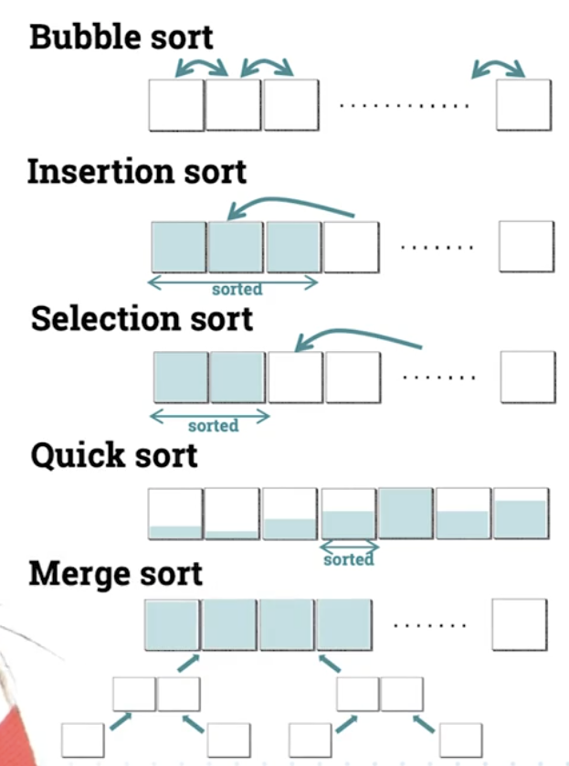
- 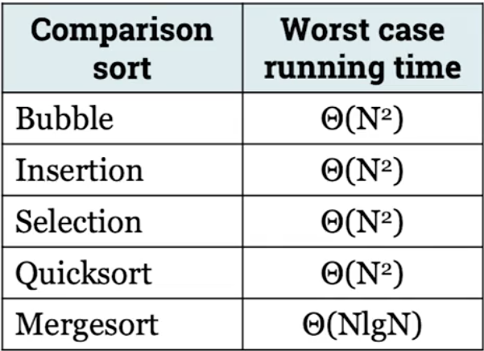
- 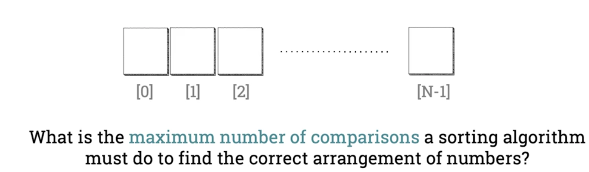
- 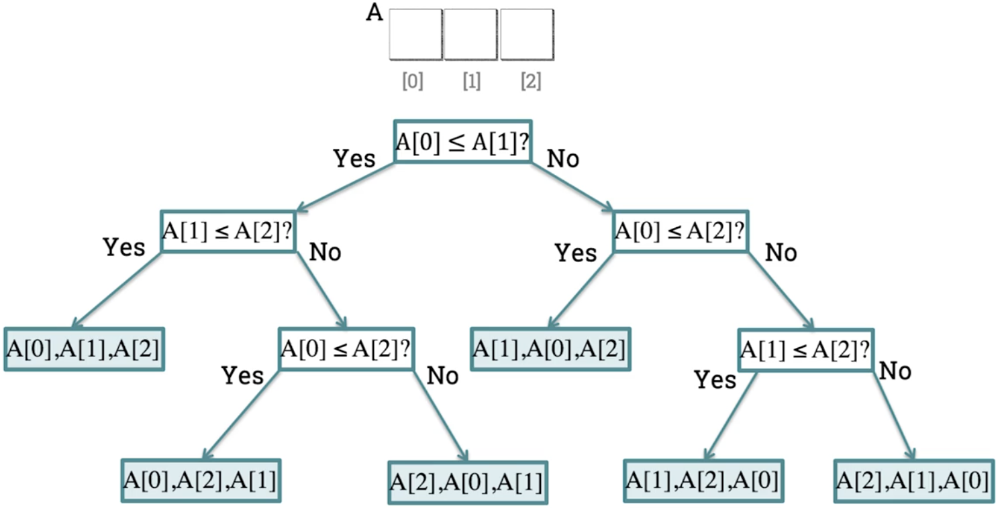
- 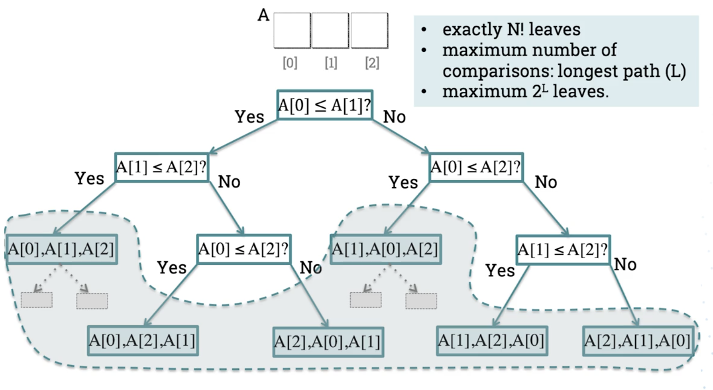
- 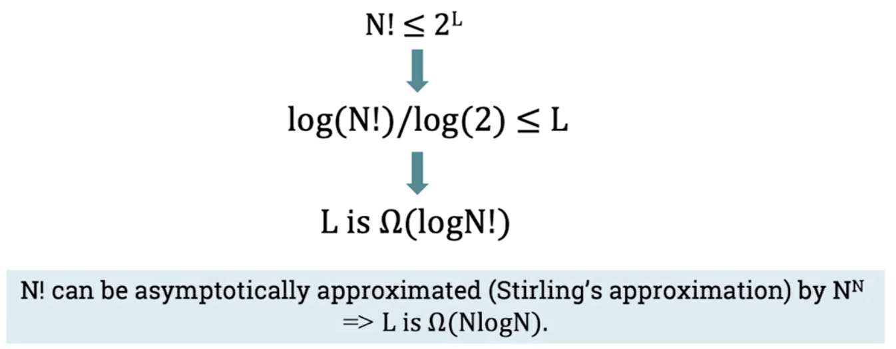
- Therefore comparison based algorithms cannot be any better than NlogN in the worst case

## Counting sort
- Countin sort is a NON-comparison sort
- 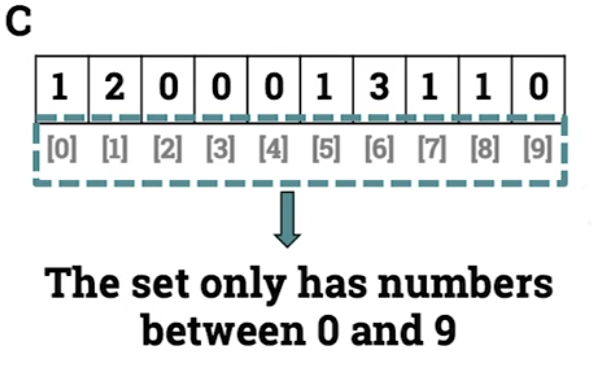
- 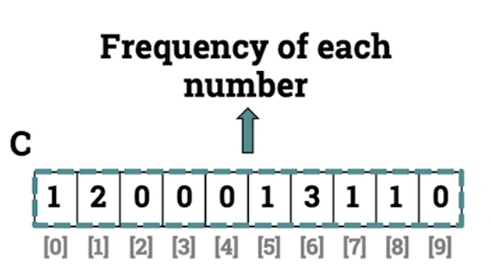
- 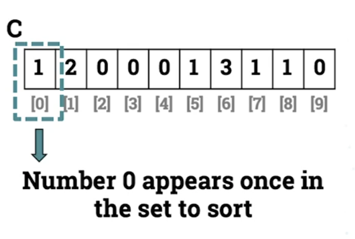
- 
- 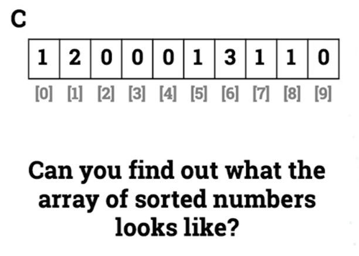
- The array looks like:
    - [0,1,1,5,6,6,6,7,8]
- 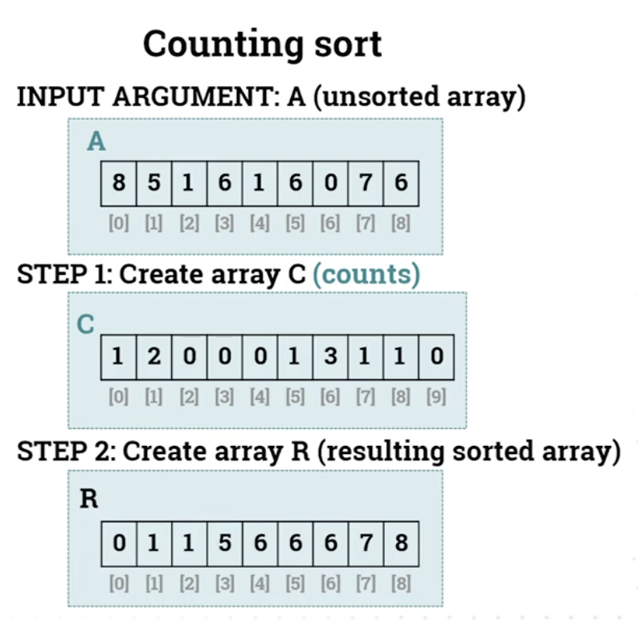

### We dont compare numbers, we sort them
- INPUT ARGUMENT:A
    - A=[2,3,5,8,2,9,5,2]
- STEP 1.1: 
    - Create array C, with (k+1) elements, k being maximum value of A, in this case 9
        - C=[0,0,0,0,0,0,0,0,0]
- STEP 1.2 :
    - Count frequencies of how many times each index value appears in the input array.:
        - C=[0,0,3,1,0,2,0,0,1,1]
- STEP 2:
    - Create array R, with as many elements as array A, and fill with numbers from array C where they have been counted
        - R=[2,2,2,3,5,5,8,9]
- 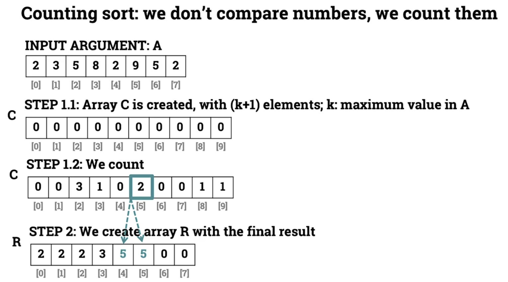

### Drawbacks of counting sort
1. It can only sort integers
2. Extra memory used by array C, which can be significant if maximum number in array A is very large

## Counting sort pseudocode

- First For loop fill the array C by counting occurrences of integers and incrementing value at corresponding index (STEP 1)
- Second For loop transfers counted values from C to R, creating final sorted array
```
A:1D array
k:maximums value in A

function countingSort(A,k)
    C<--new_array(k+1) of zeros
    R<--new_array(length(A)) of zeros
    pos<--0
    for 0 <= j < length(A) do
        C[A[j]] <-- C[A[j]] + 1
    end for
    for 0 <= i < (k+1) do
        for pos <= r < pos+C[i] do
            R[r] = i
        end for
        pos=r
    end for
    return R
end function 
```

### Example
- A = [2,0,7,0,3]
- k = 7
- C = [2,0,1,1,0,0,0,1]
- R = [0,0,2,3,7]